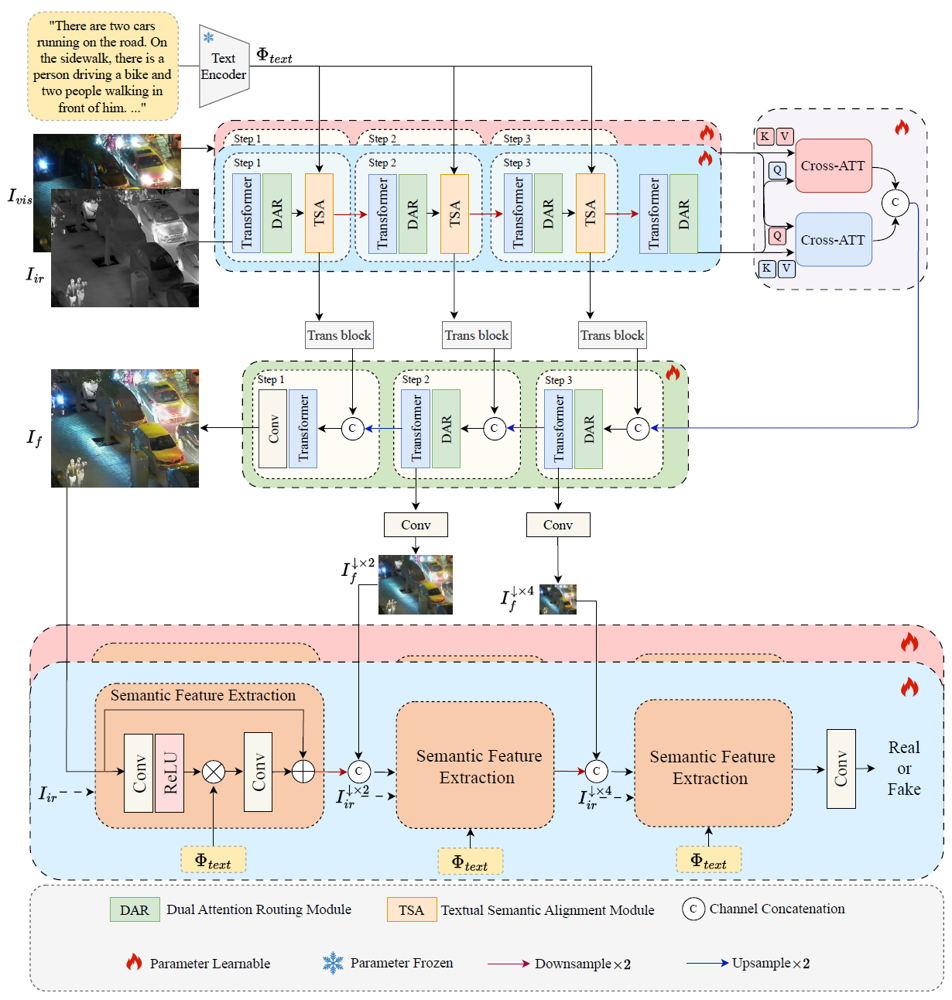

# Progressive Text-Semantic-Aware Generative Adversarial Network for Image Fusion (PTS-GAN)

This repository contains a PTS-GAN implementation adapted for paired MRI-T1/MRI-T2 image fusion with BERT-based pathology and ultrasound text conditioning. 

### Abstract
*Medical image fusion aims to synthesize comprehensive representations that preserve complementary anatomical and diagnostic cues from paired modalities. Existing fusion methods predominantly focus on pixel-level feature combinations but struggle to maintain semantic coherence in complex scenarios.
To address this challenge, this implementation uses a Progressive Text-Semantic-Aware Generative Adversarial Network (PTS-GAN) for MRI-T1 and MRI-T2 image fusion.
Specifically, we present a semantic-aware generator to preserve multi-scale local-global features of cross-modal semantics. It integrates the Dual Attention Routing~(DAR) module with the Transformer architecture.Meanwhile, this implementation uses BERT text embeddings in the Textual Semantic Alignment~(TSA) module to align modality-specific text descriptions with multi-scale visual features. Moreover, a dual progressive discriminator is built to maintain semantic consistency between fused and source images through hierarchical adversarial training. Comprehensive experiments demonstrate that the proposed model outperforms the state-of-the-art methods objectively and subjectively.*

### Summary figure

<p align="center">

</p>

## Code
### Install dependencies

```
# install cuda
Recommended cuda11.1

# create conda environment
conda create -n pts-gan python=3.9.12
conda activate pts-gan

# select pytorch version (recommended torch 1.8.2)
pip install -r requirements.txt
```

### To test
For MRI-T1/MRI-T2 image fusion:
```
python test_rgb.py
```

### To train
The default dataset layout is:
```
/data/wangjiaqi/fusion/MRI-T1
/data/wangjiaqi/fusion/MRI-T2
/data/wangjiaqi/fusion/Pathology_Orders
/data/wangjiaqi/fusion/Ultrasound_Orders
```

Training defaults to GPUs `0,1,2,3,4,5,6,7` with `DataParallel`:
```
python train.py
```
